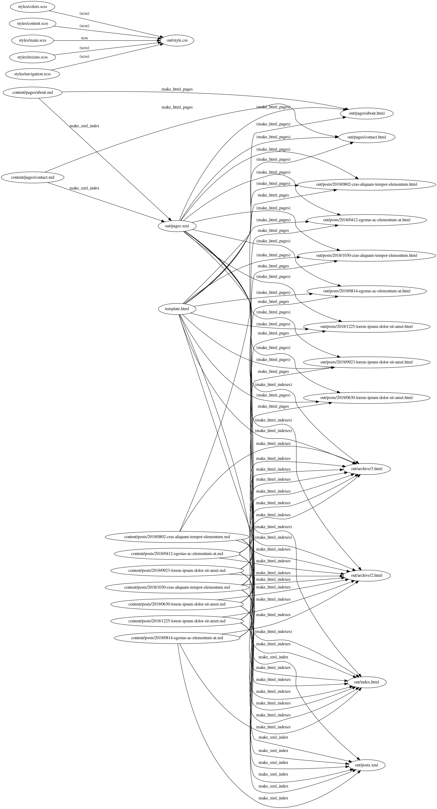

Pyrrhic
=======

Pyrrhic is a programmable Python build system that supports incremental
compilation, dynamic dependencies, and powerful builtins for a range of tasks.

Features
--------

### Programmable

* Build commands are simple Python functions

* Build rules are a simple Python list

### Dynamic dependencies

* Pyrrhic automatically detects additional file dependencies without you having
to name them explicitly

* Pyrrhic automatically knows that if input "A" produces output "B", and input
"B" produces output "C", then output "C" also depends on "A".

* Pyrrhic doesn't just track files: it also tracks the Python bytecode of the
command used to create an output! Change how a build command is implemented,
and Pyrrhic knows to update the target.

### Correct and minimal

Pyrrhic keeps the system up to date (correct) with the minimum of work. It will
always apply the smallest subtree of a dependency graph. If nothing changes,
then pyrrhic does nothing!

Usage
-----

See examples folder.

Tutorials coming soon...

